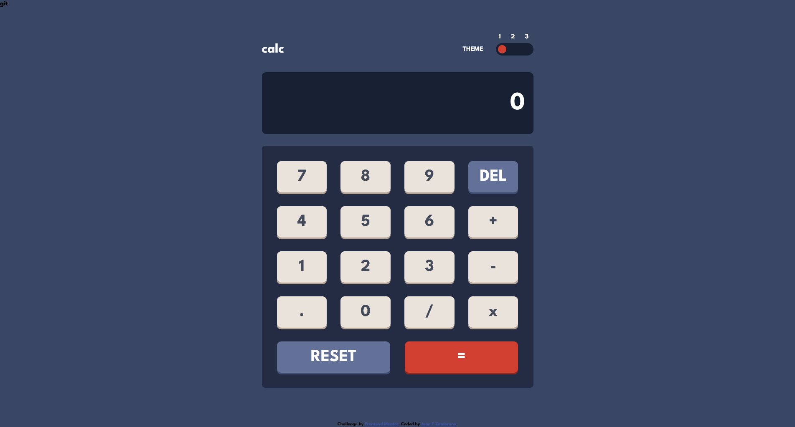

# Frontend Mentor - Calculator app solution

This is a solution to the [Calculator app challenge on Frontend Mentor](https://www.frontendmentor.io/challenges/calculator-app-9lteq5N29). Frontend Mentor challenges help you improve your coding skills by building realistic projects.

## Table of contents

- [Overview](#overview)
  - [The challenge](#the-challenge)
  - [Screenshot](#screenshot)
  - [Links](#links)
- [My process](#my-process)
  - [Built with](#built-with)
  - [What I learned](#what-i-learned)
  - [Continued development](#continued-development)
  - [Useful resources](#useful-resources)
- [Author](#author)

## Overview

### The challenge

Users should be able to:

- See the size of the elements adjust based on their device's screen size
- Perform mathmatical operations like addition, subtraction, multiplication, and division
- Adjust the color theme based on their preference
- **Bonus**: Have their initial theme preference checked using `prefers-color-scheme` and have any additional changes saved in the browser

### Screenshot

### Links

- Solution URL: [https://github.com/jeansy42/calculator-app-with-react](https://github.com/jeansy42/calculator-app-with-react)
- Live Site URL: [https://jeansy42.github.io/calculator-app-with-react/](https://jeansy42.github.io/calculator-app-with-react/)

## My process

### Built with

- Semantic HTML5 markup
- CSS custom properties
- Flexbox
- CSS Grid
- Mobile-first workflow
- [React](https://reactjs.org/) - JS library

### What I learned

The development of this project was important as it was my first time using React and putting its main concepts into practice. Developing the logic for the calculator to make it as close as possible to professional ones was quite a challenge, which required me to use regular expressions, a term that many find complex. Overall, I learned much more about Javascript, its frameworks, and programming in general.

### Continued development

I intend to continue developing my skills in JavaScript and React through the creation of more complex projects, making my knowledge increasingly useful, and ultimately securing my first job as a programmer.

### Useful resources

- [ChatGPT](https://chat.openai.com/) - My right hand, always clarifying doubts and making development more viable.

## Author

- Frontend Mentor - [@jeansy42](https://www.frontendmentor.io/profile/jeansy42)
- Twitter - [@jeansy42](https://www.twitter.com/jeansy42)
